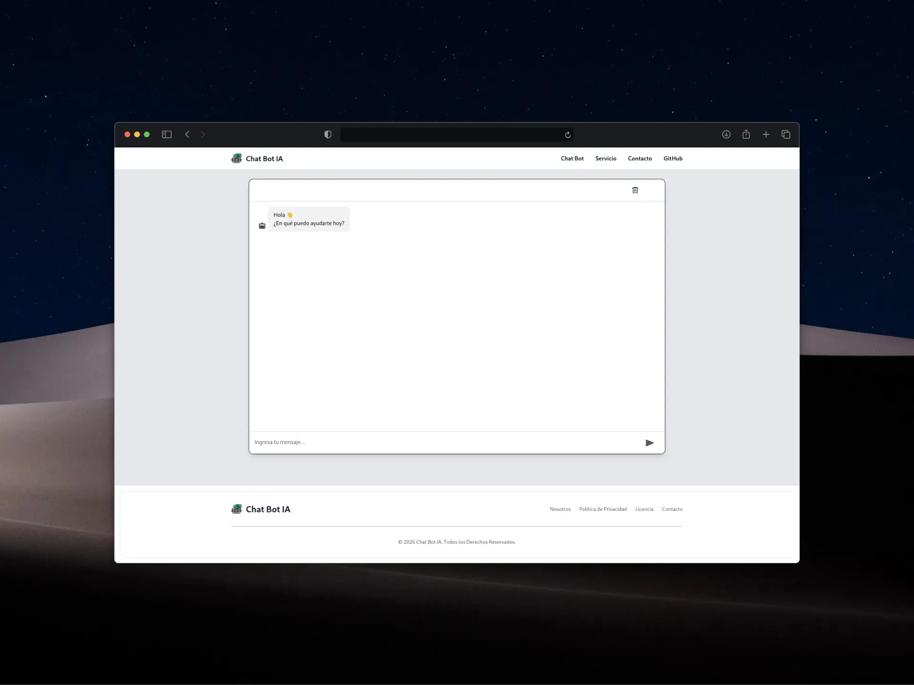

# Chat Bot Landing



Interfaz moderna de landing page + chatbot IA con soporte para múltiples canales de comunicación. Construido con React, TypeScript y Tailwind CSS.

## Descripción

Este proyecto es una **landing page completa + interfaz de chatbot** que se integra con una mi propia API REST (Groq IA) para responder preguntas en tiempo real. Incluye:

- Chatbot interactivo con historial persistente
- Múltiples páginas (Home, Servicios, Sobre, Contacto)
- Diseño fully responsive
- UI moderna con Tailwind CSS + Flowbite
- Performance optimizado con Vite
- Integración con API REST (Mi API REST)
- Formulario de contacto con validación

## Repositorio de la API REST - NODE - TS - GROQ

<https://github.com/SASOPELANA/api-rest-groq-ts>

## Requisitos Previos

Antes de empezar, asegúrate de tener instalado:

- **Node.js** >= 18.x
- **npm** o **pnpm** (se recomienda pnpm)

```bash
# Instalar pnpm globalmente (opcional pero recomendado)
npm install -g pnpm
```

## Instalación

### 1. Clonar el repositorio

```bash
git clone https://github.com/SASOPELANA/chat-bot-landing.git
cd chat-bot-landing
```

### 2. Instalar dependencias

```bash
pnpm install
```

### 3. Configurar variables de entorno

Copia el archivo `example.env` y créalo como `.env.local`:

```bash
cp example.env .env.local
```

Edita `.env.local` y agrega tu API key de Groq:

```env
VITE_API_GROQ_IA=https://api.groq.com/tu-endpoint
```

### 4. Iniciar desarrollo

```bash
pnpm run dev
```

La app estará disponible en `http://localhost:5173`

## Scripts Disponibles

```bash
# Desarrollo
pnpm run dev

# Build para producción
pnpm run build

# Preview del build
pnpm run preview

# Linting y validación
pnpm lint
```

## Estructura del Proyecto

```
src/
├── components/
│   ├── pages/           # Páginas principales (Home, About, Service, Contact)
│   ├── ui/              # Componentes UI reutilizables
│   ├── Layout.tsx       # Wrapper principal con rutas
│   ├── Navbar.tsx       # Navegación
│   ├── Footer.tsx       # Pie de página
│   ├── Form.tsx         # Formulario de contacto
│   └── FlowbiteSetup.tsx # Setup de Flowbite
├── pages/               # Wrappers de página (page routes)
├── api/
│   └── api.ts           # Configuración de Axios
├── model/
│   └── service.model.tsx # Data de servicios
├── types/
│   └── service.types.ts  # Tipos de TypeScript
├── style/
│   └── home.css         # Estilos customizados
└── assets/
    ├── fonts/           # Fuentes locales (Montserrat)
    └── icons/           # Iconos utilizados
```

## Librerías y Dependencias

| Librería | Versión | Propósito |
|----------|---------|----------|
| React | 19.2 | Framework principal |
| TypeScript | 5.9 | Type safety |
| Tailwind CSS | 4.1 | Estilos CSS |
| Flowbite | 4.0 | Componentes UI |
| Axios | 1.13 | Llamadas HTTP |
| React Router DOM | 7.13 | Navegación |
| React Helmet | 2.0 | Meta tags dinámicos |
| React Icons | 5.5 | Iconografía |
| Vite | 7.3 | Build tool |
| Deep Chat React | 1.13 | Chatbot |

## Características Principales

### Páginas

- **Home** - Interfaz de chatbot interactivo con historial
- **Servicios** - 3 servicios principales con features detalladas
- **Sobre Nosotros** - 6 características clave del proyecto
- **Contacto** - Formulario de contacto + información
- **404** - Página de error personalizada

### Chatbot

- Mensajes persistentes en `localStorage`
- Integración con API REST (Groq IA)
- Interfaz moderna y responsive
- Soporte para Enter (enviar) y Shift+Enter (nueva línea)
- Indicador de escribiendo
- Botón para limpiar historial

### Formulario de Contacto

- Validación de campos
- Teléfono validado (10 dígitos)
- Integración con **FormSubmit.co**
- Respuestas automáticas configurables

## Configuración API

### Groq IA

El proyecto usa Groq como proveedor de IA. Para configurarlo:

1. Obtén tu API key en [groq.com](https://groq.com)
2. Copia tu API key en `.env.local`
3. El endpoint se configura en `src/api/api.ts`

```typescript
const api = axios.create({
  baseURL: import.meta.env.VITE_API_GROQ_IA,
  headers: {
    'Content-Type': 'application/json',
  },
});
```

## Build para Producción

```bash
# Compilar TypeScript + Vite
pnpm run build

# Previewear el build localmente
pnpm run preview
```

El output estará en la carpeta `dist/`

## Linting

```bash
# Validar código con ESLint
pnpm lint
```

El proyecto usa ESLint con TypeScript + React Hooks eslint plugins.

## Notas Importantes

- El archivo `.env.local` **NO** debe commitearse (añadido a `.gitignore`)
- Los estilos de Flowbite se reinician en cada cambio de ruta (FlowbiteSetup)
- El historial del chat se persiste en `localStorage`
- Usa Tailwind CSS v4 con el plugin de Vite
- El formulario de contacto redirige a `https://chat-bot-landing.vercel.app/`

## Autor

Creado por SASOPELANA - 2026

## Licencia

Este proyecto está disponible bajo licencia MIT.
